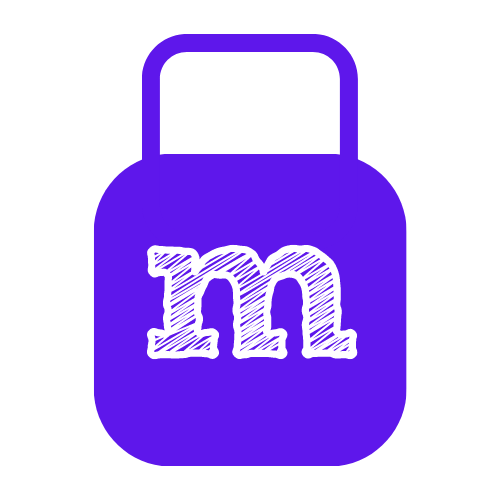

 

  

<h1 align="center">Modren</h1>

**v1.0.0**

Made with ❤️ for 🐧
 

[![Contributors][contributors-shield]][contributors-url]
[![Forks][forks-shield]][forks-url]
[![Stargazers][stars-shield]][stars-url]
[![Issues][issues-shield]][issues-url]
[![MIT License][license-shield]][license-url]

  

    Modren is a modern store for Linux. It includes support for snaps, flatpaks from Flathub, APT packages and DEBs.
     
     
    <a href="https://github.com/RudraSwat/modren/issues">Report Bug</a>
    ·
    <a href="https://github.com/RudraSwat/modren/issues">Request Feature</a>
  

[![Modren Screenshot][product-screenshot]](https://github.com/RudraSwat/modren)

Modren is a modern take on stores like GNOME Software and Discover, which includes support for APT packages, Snaps, Flatpaks from Flathub and DEB files out-of-the-box. It currently only supports Debian-based distributions like Ubuntu, but I'll be adding support for other distros like Fedora and Arch too. I'll also be adding support for makedeb packages. Unlike the other stores, modren does not index the different databases. Instead, you can directly add/publish apps to the store, making it a way for Linux developers to easily publish their apps and make them available for everyone to use.

(<a href="#top">back to top</a>)

<!-- COMPARISON -->
| Name of store | Differences |
|---------------|-------------|
| GNOME Software | Modren uses Electron unlike GNOME Software, which uses GTK; Modren is much lighter; It has a much easier way to publish apps from inside the store itself, while GNOME Software requires you to get your app added to a repository |
| KDE Discover | similar to GNOME Software |
| deb-get | Modren has a GUI; deb-get supports only debs; app publishing is similar in both but you can directly publish apps from inside the Modren UI, while deb-get requires you to create a pull request in GitHub to create a function for the app in the main script |

(<a href="#top">back to top</a>)

<!-- BACKENDS -->
## Supported backends

- APT packages
- Snaps
- Flatpaks from Flathub
- DEB package files

(<a href="#top">back to top</a>)

<!-- DEPENDENCIES -->
## Dependencies

- zenity
- pkexec

(<a href="#top">back to top</a>)

<!-- ENVIRONMENTS -->
## Supported environments

- Ubuntu
- Debian-based distros

(<a href="#top">back to top</a>)

<!-- ROADMAP -->
## Roadmap

- [x] Support for different backends.
- [x] Support for installation of packages.
- [x] Support for removal of packages.
- [x] Package as AppImage.
- [ ] Add support for Arch.
- [ ] Add MPR package support.
- [ ] Add support for Fedora.

See the [open issues](https://github.com/RudraSwat/modren/issues) for a full list of proposed features (and known issues).

(<a href="#top">back to top</a>)

<!-- CONTRIBUTING -->
## Contributing

Contributions are what make the open source community such an amazing place to learn, inspire, and create. Any contributions you make are **greatly appreciated**.

If you have a suggestion that would make this better, please fork the repo and create a pull request. You can also simply open an issue with the tag "enhancement".
Don't forget to give the project a star! Thanks again!

1. Fork this repository
2. Create a feature branch (`git checkout -b feature/AmazingFeature`)
3. Commit your changes (`git commit -m 'Add some AmazingFeature'`)
4. Push to the branch (`git push origin feature/AmazingFeature`)
5. Open a pull request

(<a href="#top">back to top</a>)

<!-- LICENSE -->
## License

Distributed under the GPL-3.0 License. See `LICENSE` for more information.

(<a href="#top">back to top</a>)

[contributors-shield]: https://img.shields.io/github/contributors/RudraSwat/modren.svg?style=for-the-badge
[contributors-url]: https://github.com/RudraSwat/modren/graphs/contributors
[forks-shield]: https://img.shields.io/github/forks/RudraSwat/modren.svg?style=for-the-badge
[forks-url]: https://github.com/RudraSwat/modren/network/members
[stars-shield]: https://img.shields.io/github/stars/RudraSwat/modren.svg?style=for-the-badge
[stars-url]: https://github.com/RudraSwat/modren/stargazers
[issues-shield]: https://img.shields.io/github/issues/RudraSwat/modren.svg?style=for-the-badge
[issues-url]: https://github.com/RudraSwat/modren/issues
[license-shield]: https://img.shields.io/github/license/RudraSwat/modren.svg?style=for-the-badge
[license-url]: https://github.com/RudraSwat/modren/blob/master/LICENSE
[linkedin-shield]: https://img.shields.io/badge/-LinkedIn-black.svg?style=for-the-badge&logo=linkedin&colorB=555
[product-screenshot]: screenshots/modren-store.gif